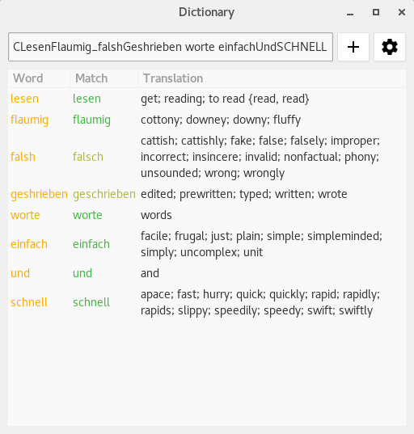

# RunningDict

This project is fast translator for programmers. It is capable of dissasembling
camelCases, underscore_case and CThisIsClass names. It internaly uses
dictd-like dictionaries.

## Binary files

There are two options how to use this. Executable from command line, or library
with C interface.

### Executable

Executable has the name runningDict(.exe). For implementation see main.cpp.

*Command line arguments reference:*

* -d [file] - dictionary file
* -D [file] - dictionary with higher priority, gets also partial words
* -j[num] - number of threads, defaults to number of cores
* -h --help - prints help
* --in - after this command all others are handled like input arguments

*Usage exaple:*

`./runMe -j8 -d freedict-deu-eng.dict -D test.dict Ihre deutsch ist CStrukturKeine`

### Library

libRunningDict.so or libRunningDict64.dll or libRunningDict32.dll. For
interface see LibInterface.h file. Library has advantage of needing to load
dictionary only once and then only processing new searches. Command line
application has to load dictionaries every time it is executed.

For example response to "CKeineKatz ihre" can match following JSON object:
~~~
{
    "results": [
        {
            "word": "keine"
            "score": 0,
            "matches": [
                ["keine", "neither; no; none"]
            ],
        },
        {
            "word": "katz"
            "score": 1,
            "matches": [
                ["latz", "bib"],
                ["katze", "cat; tabby"],
                ["satz", "clause; dart; jerk; phrase; record; sentence; set"],
                ["kauz", "codger; fogey"]
            ],
        },
        {
            "word": "ihre"
            "score": 0,
            "matches": [
                ["ihre", "her; hers; their; theirs"],
                ["ihre", "your"]
            ],
        }
    ],
    "speed": 0.018015
}
~~~

Note the type in Katze word. Library will return four possible translations and
they can be presented to user and he can then better understand which one is
correct.

### Gui executable

Standalone application (runningDictGui) which is designed to translate
clipboard content on the fly.  Has an option to quickly add new translation to
custom dictionary and quickly toogle used dictionaries. Also by double click,
you can change the translation of the word.

Configuration is stored in `$HOME/.config/runningdict` on linux and
`$APPDATA/runndingdict` on windows.

RunningDict is trying to find all dictionaries in its install folder (Program
Files or /usr/share/). You can add additional dictionaries by editing json
config file and adding absolute path into *additionalSearchDirs* array.

## Build

### Prerequisites for build

* CMake 3.2 and newer
* C++14 capable compiler
* Doxygen for docs (*Graphviz for more graphs in docs, PlantUML for more UML diagrams*, PlantUML needs java)
* Python3 for running tests
* clang-tools for static analysis and formating
* Gtkmm3 for standalone gui application
* git for downloading dependencies

    TODO libcurl4-openssl-dev libssh2-1-dev libssl-dev

#### Prerequisites on Linux

* Arch Linux: `sudo pacman -S cmake g++ graphviz git clang clang-tools-extra cppcheck java-runtime-common extra/gtkmm3`
    * download plantuml.jar and have it somewhere where *PATH* points to

* Ubuntu 16.04: `sudo apt-get install cmake g++ graphviz plantuml git clang clang-tidy clang-format libgtkmm-3.0-dev`

#### Prerequisites on Windows

* Install msys2 and install these packages:
    * Minimal: `pacman -S cmake g++ git mingw-w64-x86_64-gtkmm3`
    * Additional software `pacman -S mingw-w64-x86_64-clang mingw-w64-x86_64-clang-tools-extra mingw-w64-x86_64-clang-analyzer doxygen`
    * For graphs in documentation install Graphviz (to `c:\Program Files\Graphviz`, so scripts can find it) and add its `bin` subdirectory to *PATH*, install java (have it on *PATH*), download PlantUML jar file and have it on *PATH*.

### CMake options

|             option             |       description                |
|--------------------------------|----------------------------------|
| -DCMAKE_CXX_COMPILER="clang++" | change compiler to clang         |
| -DCMAKE_BUILD_TYPE=Release     | change build type to Release     |
| -DVERSION_TYPE=stable          | change version type to stable    |
| -DVERSION_HOST=build           | change build machine name        |
| -DCMAKE_INSTALL_PREFIX="/"     | change install location          |
| -DUSE_BOOST_FILESYSTEM=FALSE   | whether to use boost::filesystem instead of the experimental filesystem |

### Build targets

| Target          | Description                                     |
|-----------------|-------------------------------------------------|
| all             | build all                                       |
| install         | install to install prefix location              |
| package         | generates packages (DEB, RPM, MSI, etc.)        |
| gui-run run     | install and run gui standalone gui application  |
| gdb             | runs gdb on gui app                             |
| doc             | produce doxygen documentation                   |
| unit            | run unit tests only                             |
| check           | run integration and unit tests                  |
| checkVerbose    | run integration and unit tests with full output |
| tidy            | run static analysis                             |
| cppcheck        | run static analysis                             |
| format          | run clang-format on code                        |
| clean           | clean build files                               |
| external-update | clean build files                               |

Note: You need to run **update** target first in order to download external dependencies, this is enough to do once from start.

### Build on linux

Standard Makefiles:
~~~
mkdir build ; cd build
cmake ..
make update
make -j8 install
~~~

Ninja build witch clang, build all and install it to dist folder, also build docs which will be in `[build_dir]/doc/doc/index.html`:
~~~
mkdir build ; cd build
cmake -GNinja -DCMAKE_CXX_COMPILER="clang++" ..
ninja update
ninja all doc install
~~~

There are basic tests which can be exuted by building **check** target.

~~~
mkdir build ; cd build
cmake ..
make update
make check
~~~

Update is needed only once for downloading of dependencies.

If you want to install the software, do this:

~~~
mkdir build ; cd build
cmake -DCMAKE_INSTALL_PREFIX="/usr" -DCMAKE_BUILD_TYPE=Release -DVERSION_HOST=linux -DVERSION_TYPE=stable ..
sudo make install
~~~

### Build on windows

* note on call graphs and rest: Since there is no package in MSYS2, getting more graphs to work could be challenging.

#### Build on windows using MSYS2 + ninja

On windows prefer Ninja since it is **MUCH** faster than make.

With gcc build and install (default is build/dist):
~~~
mkdir build ; cd build
cmake -GNinja ..
ninja update
ninja install
~~~

With clang++, build executable, doxygen documentation and install:
~~~
mkdir build ; cd build
cmake -GNinja -DCMAKE_CXX_COMPILER="clang++" ..
ninja update
ninja all doc install
~~~

Notes for sublime text: You want to have *c:/runLinux32.bat* with this:
~~~
set MSYSTEM=MINGW32
C:\msys64\usr\bin\bash.exe --login -c "cd - ; %*"
~~~
    * and edit makebuildrun.sh and ninjabuildrun.sh to execute final executable

#### Build on Windows using Microsoft Visual Studio 14

First you can edit `CMakeLists.txt` and set new project name. Just go to the
folder with the project and create new directory and create project files with
this:

~~~
mkdir buildmsvc
cd buildmsvc
cmake -G "Visual Studio 14 2015" ..
~~~

and you can now open a `.sln` file with Visual Studio. You need to RMB click on
executable target and *Set as StartUp project*. To really see the console
window you want to do *Start without debugging*, when run in debug mode,
console widow is closed too fast.

**Note:** as of 03/2016 Visual studio has a
[bug](https://social.msdn.microsoft.com/Forums/en-US/8f40dcd8-c67f-4eba-9134-a19b9178e481/vs-2015-rc-linker-stdcodecvt-error?forum=vcgeneral)
which prevents this project being built.

### Release

* Increase version in master *CMakeLists.txt*.
* Build configuration
    * Windows: `cmake -GNinja -DCMAKE_BUILD_TYPE=Release -DUSE_BOOST_FILESYSTEM=TRUE -DVERSION_HOST=win7 -DVERSION_TYPE=stable ..`
    * Linux: `cmake -GNinja -DCMAKE_BUILD_TYPE=Release -DVERSION_HOST=linux -DVERSION_TYPE=stable ..`
* `ninja check`
* `ninja package`
* packages are in *out* directory inside of the build folder.
* commit changes
* create git tag
* push changes and tag to server

## Notes

### Speed reference table

Measured on i7-4770 (4cores + HT) @ Linux 3.16.0

| # of threads | time [ms] | speedUp |
|-------|-------|------|
|  12   | 84    | 2.6  |
|  10   | 87    | 2.5  |
|  9    | 84    | 2.6  |
|  8    | 76    | 2.93 |
|  7    | 81    | 2.7  |
|  6    | 89    | 2.5  |
|  5    | 96    | 2.3  |
|  4    | 101   | 2.2  |
|  3    | 91    | 2.4  |
|  2    | 121   | 1.84 |
|  1    | 223   | 1    |

### Sublime text

In sublime project file there are defined two build systems - one for *make*
and second for *ninja*. For build output higlighting you need package
[cppinabox](https://github.com/kracejic/cppinabox). And all builds contains
running of tests. :)

If you get "Error loading syntax file" during build, that means, you do not
have cppinabox installed and you either need to install it, or remove *syntax*
from build system in sublime-project file.

## Developing

* [Basic directory structure](doc/directoryStructure.md)

# License

> Copyright (c) 2017 Kracejic
>
> Permission is hereby granted, free of charge, to any person obtaining a copy of this software and associated documentation files (the "Software"), to deal in the Software without restriction, including without limitation the rights to use, copy, modify, merge, publish, distribute, sublicense, and/or sell copies of the Software, and to permit persons to whom the Software is furnished to do so, subject to the following conditions:
>
> The above copyright notice and this permission notice shall be included in all copies or substantial portions of the Software.
>
> THE SOFTWARE IS PROVIDED "AS IS", WITHOUT WARRANTY OF ANY KIND, EXPRESS OR IMPLIED, INCLUDING BUT NOT LIMITED TO THE WARRANTIES OF MERCHANTABILITY, FITNESS FOR A PARTICULAR PURPOSE AND NONINFRINGEMENT. IN NO EVENT SHALL THE AUTHORS OR COPYRIGHT HOLDERS BE LIABLE FOR ANY CLAIM, DAMAGES OR OTHER LIABILITY, WHETHER IN AN ACTION OF CONTRACT, TORT OR OTHERWISE, ARISING FROM, OUT OF OR IN CONNECTION WITH THE SOFTWARE OR THE USE OR OTHER DEALINGS IN THE SOFTWARE.
